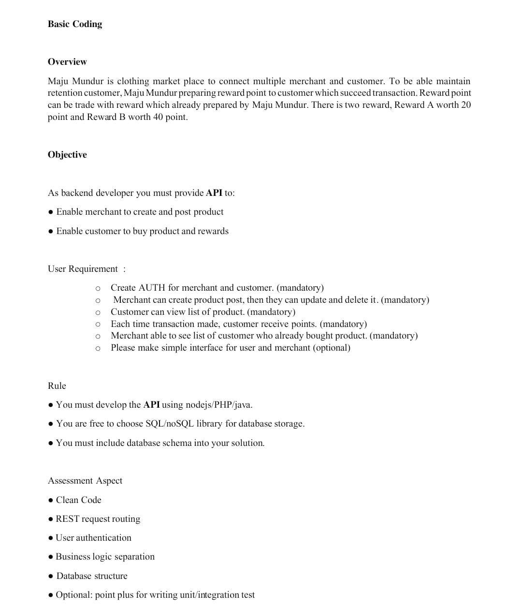
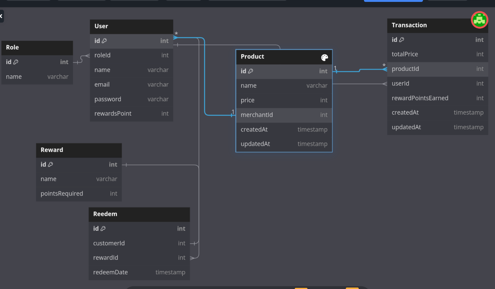

# Test BPD(maju mundur)

Soal


ERD


## Getting Started

### Dependencies

- required Nodejs & PostgreSQL

### Installing

clone:
```bash
git clone https://github.com/jonfry1175/enigma-test-bpd.git
```

Navigate to the server directory:
```bash
cd enigma-test-bpd/
```

```bash
cd server
```

install all dependencies:
```bash
pnpm install
```

### Executing program

1. Create database:
```bash
pnpm run create
```

2. Run migrations:
```bash
pnpm run migrate
```

3. Seed the database:
```bash
pnpm run seed
```

4. Run the API server
```bash
node app.js
```

or if you have installed nodemon, run:
```bash
pnpm start
```


# API Documentation
The Postman collection can be found in the root directory, named TEST_BPD.postman_collection.json, You can import this file into Postman to test the API.
